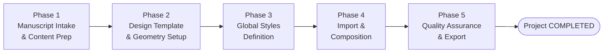
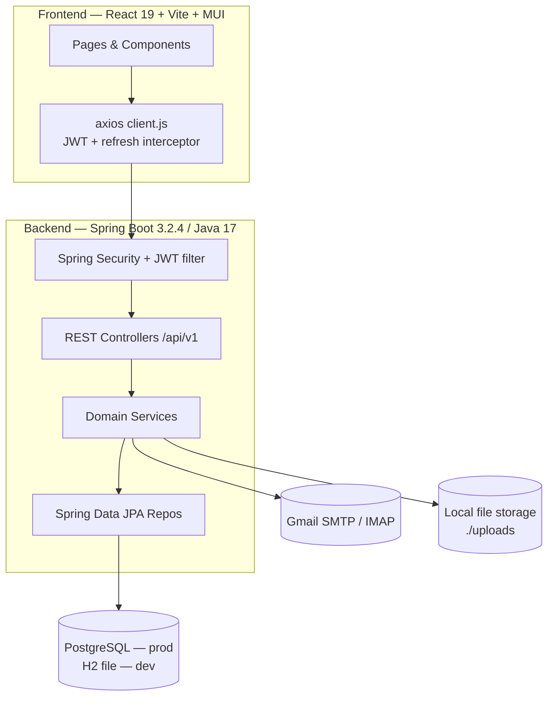
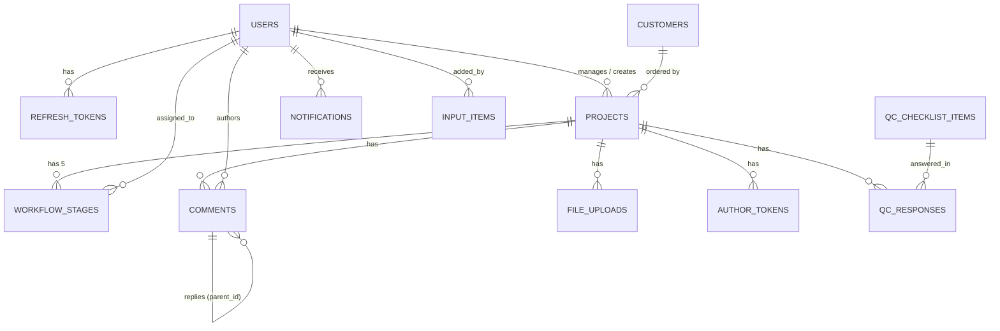
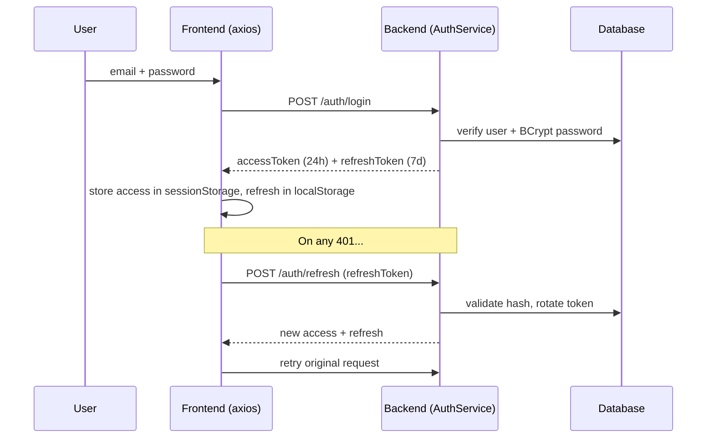
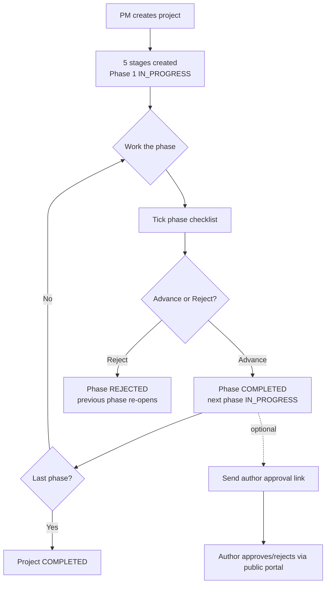
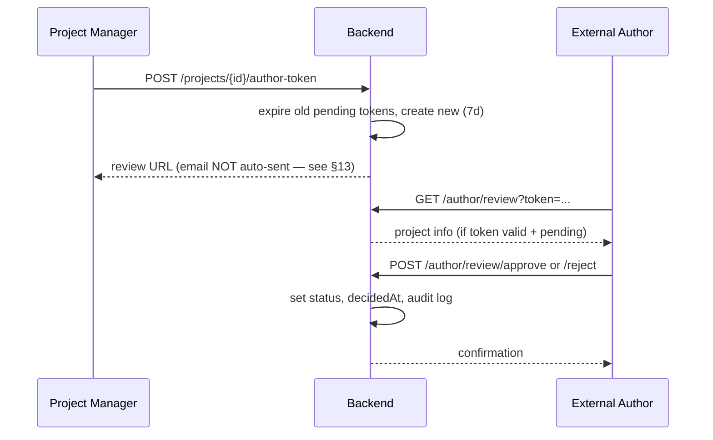

# ProTrack — Publishing Workflow Management System
### Software Requirements & Project Documentation

> Branding note: the product is referred to as **ProTrack** in the UI navigation, login, and author portal; the codebase and package are named **PublishFlow** / `publishing-workflow-ui`; the logo asset is **B2K** (`src/assets/b2k-logo.png`). These names refer to the same application. This document uses **ProTrack**.

This document was reverse-engineered from the actual source code. Where a detail could not be confirmed from the code, it is explicitly marked **"Not found in source code."**

---

## Table of Contents

1. [Executive Summary](#1-executive-summary)
2. [Business Workflow](#2-business-workflow)
3. [User Roles](#3-user-roles)
4. [Complete Feature List](#4-complete-feature-list)
5. [Screen-by-Screen Documentation](#5-screen-by-screen-documentation)
6. [Architecture Overview](#6-architecture-overview)
7. [Database Documentation](#7-database-documentation)
8. [API Documentation](#8-api-documentation)
9. [Business Rules](#9-business-rules)
10. [Project Flow Diagrams](#10-project-flow-diagrams)
11. [Folder Structure Explanation](#11-folder-structure-explanation)
12. [Technology Stack](#12-technology-stack)
13. [Missing / Incomplete Features](#13-missing--incomplete-features)
14. [Security](#14-security)
15. [Performance](#15-performance)
16. [Future Improvements](#16-future-improvements)
17. [Developer Setup](#17-developer-setup)
18. [Client-Friendly Summary](#18-client-friendly-summary)

---

## 1. Executive Summary

### What is this application?
ProTrack is a **web-based management tool for book/manuscript production**. It tracks each publishing project as it moves through a defined **5-phase production workflow**, from receiving a manuscript to final export. It is a **tracking and coordination tool** — the actual typesetting/design work happens in external tools (e.g. InDesign); ProTrack records progress, assigns responsibility, stores files, and keeps everyone informed.

### What business problem does it solve?
Publishing houses run many book projects at once, each passing through several specialist teams (content prep, design, styling, composition, quality/export). Without a central system, status is scattered across emails and spreadsheets. ProTrack provides:
- A single source of truth for every project's current phase and history.
- Clear ownership (who is responsible for each phase).
- A checklist per phase so nothing is missed.
- File handling (uploads, an email inbox for incoming files, and a shared file repository).
- External author sign-off without giving authors a login.
- Management analytics and a full audit trail.

### Who are the intended users?
Internal publishing staff in four roles — **Admin, Project Manager, Production Team, QC Team** — plus **external authors** who approve proofs through a public link (no account needed).

### Main features
| Area | Feature |
|---|---|
| Projects | Create, list, filter, view, edit, status changes, soft delete |
| Workflow | 5-phase tracking with advance / reject / assign actions |
| Quality | Per-phase checklists (tick-off sub-tasks) |
| Collaboration | Threaded comments, file uploads per project |
| Email | Receive files by email (**Incoming**) and a shared **Input** repository |
| Author sign-off | Tokenized public portal for external approval/rejection |
| Templates | Library of reusable email/document templates |
| Admin | User management, audit logs |
| Analytics | Reports (status, stage, priority, team workload) |
| Notifications | In-app notification list (see §13 for current limitation) |

---

## 2. Business Workflow

### The 5-phase production workflow
The workflow is defined by the enum `WorkflowStageName.java` (backend) and `WORKFLOW_STAGES` in `src/utils/constants.js` (frontend). Declaration order = workflow order:



| # | Phase key | Label | Sub-task checklist (seeded) |
|---|-----------|-------|------------------------------|
| 1 | `MANUSCRIPT_INTAKE` | Manuscript Intake & Content Prep | Standardize files · Text cleaning · Editorial lockdown |
| 2 | `DESIGN_TEMPLATE` | Design Template & Geometry Setup | Trim size/margins/bleed · Baseline grid · Typography · Master pages |
| 3 | `GLOBAL_STYLES` | Global Styles Definition | Paragraph styles · Character styles · Object/table styles |
| 4 | `IMPORT_COMPOSITION` | Import & Composition | Flow text · Apply hierarchy · Copy-fitting pass |
| 5 | `QUALITY_EXPORT` | Quality Assurance & Export | Visual proofing · Preflight check · Final export |

### Step-by-step: what happens behind the scenes

**1. A Project Manager (or Admin) creates a project.**
- *User action:* fills the 3-step wizard (`CreateProjectForm.jsx`) — title, customer, priority, due date, project manager.
- *Behind the scenes:* `POST /api/v1/projects` → `ProjectService.create()` generates a unique `project_code` (`ProjectCodeGenerator`), sets `startedAt = now()`, and calls `WorkflowService.initializeWorkflow()`, which creates **5 `workflow_stages` rows**. Phase 1 is set `IN_PROGRESS`; phases 2–5 are `PENDING`.
- *Example:* "Atlas of Marine Biology" for Oxford University Press → code `PF-...`, current stage = *Manuscript Intake*.

**2. The responsible team works a phase and ticks its checklist.**
- *User action:* opens the project → **Phase Checklist** tab → ticks sub-tasks → Save.
- *Behind the scenes:* `POST /api/v1/projects/{id}/qc-checklist/submit` → `QcService.submit()` upserts one `qc_responses` row per (project, item) and writes an audit log `QC_SUBMITTED`.

**3. They advance the project to the next phase.**
- *User action:* in the workflow tracker, open a phase → "Mark Stage Complete."
- *Behind the scenes:* `POST /api/v1/projects/{id}/workflow/advance` → `WorkflowService.advanceStage()`. The current phase must be `IN_PROGRESS`; it becomes `COMPLETED` (with `completedAt`), the next phase becomes `IN_PROGRESS`, and `project.current_stage` moves forward.
- *Example:* Production finishes *Manuscript Intake* → project advances to *Design Template*.

**4. If a phase fails review, it is rejected.**
- *User action:* "Reject Stage" with a reason.
- *Behind the scenes:* `POST /api/v1/projects/{id}/workflow/reject` → `WorkflowService.rejectStage()`. The current phase becomes `REJECTED`; the **previous** phase re-opens (`IN_PROGRESS`), and `current_stage` moves back one.

**5. Author sign-off (optional, external).**
- *User action:* on the **Approval** tab, "Send for Approval" with the author's email.
- *Behind the scenes:* `POST /api/v1/projects/{id}/author-token` → `AuthorTokenService.generate()` expires any prior pending token, creates a new 64-hex token (default 7-day expiry), and returns a review URL. The author opens `/author/review?token=...` (public) and approves/rejects.
- *Limitation:* the email is **not actually sent** by this action — only an audit record `AUTHOR_APPROVAL_SENT` is written and a link returned (see §13).

**6. The final phase completes the project.**
- When *Quality Assurance & Export* (last phase) is advanced, `WorkflowService.advanceStage()` sets `project.status = COMPLETED` and `completedAt = now()`.

---

## 3. User Roles

Defined by `UserRole.java` (backend) and `ROLES` in `constants.js` (frontend).

| Role | Description |
|------|-------------|
| `ADMIN` | Full access: user management, audit logs, all project actions, delete |
| `PROJECT_MANAGER` | Manage projects, assign stages, view reports |
| `PRODUCTION_TEAM` | Work the production phases (1–4) |
| `QC_TEAM` | Work the quality/export phase (5) |

### Permissions matrix

Enforced on the **backend** via `@PreAuthorize` (Spring Method Security) and on the **frontend** via `src/utils/roleHelpers.js` + `ProtectedRoute`.

| Capability | ADMIN | PROJECT_MANAGER | PRODUCTION_TEAM | QC_TEAM | Source |
|---|:---:|:---:|:---:|:---:|---|
| Log in / view dashboard, projects | ✅ | ✅ | ✅ | ✅ | route auth |
| Create / update project | ✅ | ✅ | ❌ | ❌ | `@PreAuthorize` on `ProjectController` |
| Delete project | ✅ | ❌ | ❌ | ❌ | `ProjectController` |
| Advance stage | ✅ | ✅ | phases 1–4 | phase 5 | `WorkflowController` + `roleHelpers.canAdvanceStage` |
| Reject stage | ✅ | ✅ | ❌ | phase 5 | `roleHelpers.canRejectStage` |
| Assign stage | ✅ | ✅ | ❌ | ❌ | `WorkflowController` |
| Manage users | ✅ | ❌ | ❌ | ❌ | `UserController` + `ProtectedRoute roles={['ADMIN']}` |
| View reports | ✅ | ✅ | ❌ | ❌ | `ReportController @PreAuthorize` |
| View audit logs | ✅ | ❌ | ❌ | ❌ | `AuditController @PreAuthorize` |
| Upload files / comment | ✅ | ✅ | ✅ | ✅ | `roleHelpers.canUploadFiles` (always true) |
| Delete file | own or ADMIN (backend); ADMIN/PM (frontend UI) | — | — | — | `FileService.delete` / `canDeleteFile` |
| Templates, Incoming, Input | ✅ | ✅ | ✅ | ✅ | authenticated, no role restriction |

> External **authors** are not users — they act only through the public token-gated author portal.

---

## 4. Complete Feature List

### 4.1 Authentication & Session
- **Purpose:** secure login and stateless session management.
- **How it works:** email/password → JWT access token (24h) + opaque refresh token (7d). Access token in `sessionStorage`, refresh token in `localStorage`. On a 401, the axios interceptor auto-refreshes once.
- **User journey:** Login page → dashboard. Token silently refreshed during use; expiry/logout returns to login.
- **Backend:** `AuthService` (`login`, `refresh`, `logout`), `JwtTokenProvider`, `JwtAuthenticationFilter`, `UserPrincipalService`.
- **APIs:** `POST /auth/login`, `POST /auth/refresh`, `POST /auth/logout`, `GET /auth/me`.
- **Tables:** `users`, `refresh_tokens` (stores only a SHA-256 hash of the refresh token).

### 4.2 Project Management
- **Purpose:** create and track production projects.
- **How it works:** projects carry code, customer, manager, status, priority, due date, and a current phase. Listing supports filters + pagination. Deletes are soft (`deleted_at`).
- **Backend:** `ProjectService`, `ProjectCodeGenerator`.
- **APIs:** `GET/POST /projects`, `GET/PUT/DELETE /projects/{id}`, `PATCH /projects/{id}/status`, `GET /projects/{id}/activity`.
- **Tables:** `projects`, `workflow_stages`, `customers`, `users`.

### 4.3 Workflow Engine (5 phases)
- **Purpose:** drive a project through its phases with controlled transitions.
- **How it works:** `WorkflowService` uses the enum ordinal for ordering. Advance requires the stage to be `IN_PROGRESS`; reject re-opens the previous stage; assign sets a responsible user.
- **APIs:** `GET /projects/{id}/workflow/stages`, `POST .../advance`, `POST .../reject`, `POST .../stages/{stageName}/assign`.
- **Tables:** `workflow_stages`, `projects`.

### 4.4 Phase Checklists (formerly "QC Checklist")
- **Purpose:** a tick-off list of sub-tasks per phase (matches the client's phase diagram).
- **How it works:** checklist items are grouped by phase using the `category` column; each project stores per-item responses. The UI (`QcChecklistSection.jsx`) groups items into accordions by phase and shows a progress bar.
- **Backend:** `QcService` (`getChecklist`, `submit` — upsert per item, writes `QC_SUBMITTED` audit).
- **APIs:** `GET /projects/{id}/qc-checklist`, `POST .../qc-checklist/submit`.
- **Tables:** `qc_checklist_items` (16 seeded phase items), `qc_responses`.

### 4.5 Comments
- **Purpose:** threaded discussion per project.
- **How it works:** comments support replies (`parent_id`). Deletion limited to the author (UI) — see §13 (edit not wired).
- **APIs:** `GET/POST /projects/{id}/comments`, `DELETE .../comments/{commentId}`.
- **Tables:** `comments`.

### 4.6 File Uploads (per project)
- **Purpose:** store project documents categorized by type.
- **How it works:** multipart upload (max 50 MB) saved via `StorageStrategy`; categorized by `UploadCategory`. Delete allowed for the uploader or an Admin.
- **APIs:** `GET/POST /projects/{id}/files`, `GET .../files/{fileId}/download`, `DELETE .../files/{fileId}`; plus standalone `GET/DELETE /files/{fileId}`.
- **Tables:** `file_uploads`.

### 4.7 Incoming Email (file ingestion)
- **Purpose:** automatically pull attachments emailed to a mailbox into the app.
- **How it works:** `IncomingService.importFromInbox()` connects to an IMAP inbox (default Gmail), reads **unseen** messages, extracts attachments, stores them, and marks them seen. Runs on a schedule (`InboundEmailScheduler`, every 120s) and on demand. **Disabled by default** (`app.mail.inbound.enabled=false`).
- **APIs:** `GET /incoming`, `GET /incoming/unread-count`, `POST /incoming/poll`, `PATCH /incoming/{id}/handled`, `GET /incoming/{id}/download`, `DELETE /incoming/{id}`.
- **Tables:** `incoming_items`.

### 4.8 Shared Input Repository
- **Purpose:** a flat, app-wide shared folder; files moved here from Incoming are visible to all users.
- **How it works:** `InputService.moveFromIncoming()` copies the file into Input storage, records who added it, and removes the original from Incoming (a true move).
- **APIs:** `GET /input`, `POST /input/move/{incomingId}`, `GET /input/{id}/download`, `DELETE /input/{id}`.
- **Tables:** `input_items`.

### 4.9 Author Approval Portal
- **Purpose:** let external authors approve/reject a proof without an account.
- **How it works:** a project generates a one-time token (64 hex, default 7-day expiry); the author uses a public link. Only one pending token per project (older pending tokens are expired). Lazy expiry: an overdue token is flipped to `EXPIRED` on access.
- **Backend:** `AuthorTokenService` (`generate`, `getPortalInfo`, `approve`, `reject`).
- **APIs:** `POST/GET /projects/{id}/author-token`; public `GET /author/review`, `POST /author/review/approve`, `POST /author/review/reject`.
- **Tables:** `author_tokens`.

### 4.10 Templates
- **Purpose:** reusable email/document templates.
- **APIs:** `GET/POST /templates`, `GET/PUT/DELETE /templates/{id}`.
- **Tables:** `templates` (`type` is a plain string: EMAIL/DOCUMENT/QC_REPORT/APPROVAL).

### 4.11 Notifications (in-app)
- **Purpose:** per-user notification list with unread count.
- **APIs:** `GET /notifications`, `GET /notifications/unread-count`, `POST /notifications/mark-all-read`, `PATCH /notifications/read-all`, `PATCH /notifications/{id}/read`.
- **Tables:** `notifications`.
- **Limitation:** the core workflow/project services do **not** currently emit notifications (see §13).

### 4.12 Audit Logs
- **Purpose:** immutable record of key actions.
- **How it works:** `AuditService.log()` runs `@Async` in a `REQUIRES_NEW` transaction (survives caller rollback). Currently written by QC and Author-token flows.
- **APIs:** `GET /audit-logs` (ADMIN only).
- **Tables:** `audit_logs`.

### 4.13 Reports / Analytics
- **Purpose:** management dashboards.
- **How it works:** the backend exposes report endpoints, **but the frontend `ReportsPage` computes analytics client-side** from the project list (`reports.api.js` is unused — see §13).
- **APIs (backend, unused by UI):** `GET /reports/project-status`, `/reports/stage-throughput`, `/reports/team-workload`.

### 4.14 User Management
- **APIs:** `GET/POST /users`, `GET/PUT/DELETE /users/{id}`, `PATCH /users/{id}/status`.
- **Tables:** `users`.

---

## 5. Screen-by-Screen Documentation

| Page (folder) | Route | Role guard | Purpose | API modules |
|---|---|---|---|---|
| `LoginPage` | `/login` | Public | Sign in + demo accounts | `auth.api` |
| `DashboardPage` | `/dashboard` (`/` redirects) | Auth | KPIs, charts, recent projects, work queue | `projects.api` (via `useProjects`) |
| `ProjectsPage` | `/projects` | Auth | Filter/sort/paginate projects | `projects.api` |
| `CreateProjectPage` | `/projects/new` | Auth (UI-gated ADMIN/PM) | 3-step create wizard | `customers.api`, `users.api`, `projects.api` |
| `ProjectDetailPage` | `/projects/:id` | Auth | Full project workspace + tabs | `useProject`, `qc.api`, `authorToken.api` |
| `UsersPage` | `/users` | ADMIN | User admin | `users.api` |
| `ReportsPage` | `/reports` | ADMIN, PM | Analytics charts | `projects.api` (via `useReports`) |
| `AuditLogsPage` | `/audit-logs` | ADMIN | Audit trail | `audit.api` |
| `TemplatesPage` | `/templates` | Auth | Template library CRUD | `templates.api` |
| `AuthorPortalPage` | `/author/review?token=` | Public | External approval | `authorToken.api` |
| `IncomingPage` | `/incoming` | Auth | Emailed-in files | `incoming.api`, `input.api` |
| `InputPage` | `/input` | Auth | Shared repository | `input.api` |

### 5.1 LoginPage (`pages/LoginPage/`)
- **Purpose:** authenticate; left branding panel, right form.
- **Components:** `TextField` (email/password with icons + show/hide), `Button`, `Alert`, demo-account grid.
- **Form/validation:** email + password required (`"Please fill in all fields."`). On success → redirect to the originally requested page or `/dashboard`.
- **API:** `authApi.login` via `AuthContext`.
- **Note:** the marketing copy still says "8-Stage Workflow Tracking" (stale — workflow is now 5 phases). Demo cards use `@protrack.com` and password `password`.

### 5.2 DashboardPage (`pages/DashboardPage/`)
- **Components:** `StatsCards` (4 KPIs; trend numbers are hardcoded), `StageDistributionChart` (Recharts bar, colored by `PHASE_COLORS`), `WorkloadChart` (donut), `RecentProjectsTable` (top 8 by `updatedAt`), inline `WorkQueueCard` (stages assigned to me that are `IN_PROGRESS`), `TeamWorkloadBar`.
- **API:** `projectsApi.getAll` via `useProjects()`.

### 5.3 ProjectsPage (`pages/ProjectsPage/`)
- **Components:** `PageHeader` + "New Project" (gated `canCreateProject`), `ProjectFilters` (search/status/priority/stage + Clear), status quick-filter tabs, sortable `ProjectsTable`, `TablePagination` (10/20/50).
- **API:** `projectsApi.getAll({status, priority, stage, search, page, size})`; search debounced 400 ms.

### 5.4 CreateProjectPage (`pages/CreateProjectPage/CreateProjectForm.jsx`)
- **Components:** 3-step `Stepper`.
- **Forms:** Step 1 — title (required), description, customer (required), priority (default MEDIUM), due date (required). Step 2 — project manager (required). Step 3 — review.
- **Validation:** `validate()` enforces required fields; server field-errors shown via snackbar.
- **Business rule shown:** Step 3 review lists a **hardcoded 8-stage** chip list that does **not** match the 5 real phases (stale UI — see §13).
- **API:** `customersApi.getAll`, `usersApi.getAll` on mount; `projectsApi.create` on submit.

### 5.5 ProjectDetailPage (`pages/ProjectDetailPage/`)
- **Composes:** `ProjectHeader`, `WorkflowTracker`, and a `Tabs` panel.
- **ProjectHeader:** code chip, `StatusChip`, `PriorityBadge`, Edit (gated `isAdminOrPM`), status menu (ACTIVE/ON_HOLD/COMPLETED/CANCELLED).
- **WorkflowTracker:** `WorkflowStepper` (5 phases, phase-colored) + right `Drawer` with **detail** (advance — gated `canAdvanceStage`), **assign**, **reject** (gated `canRejectStage`) views.
- **Tabs:** Comments → `CommentsSection`; Files → `FilesSection`; **Phase Checklist** → `QcChecklistSection`; Approval → `SendApprovalSection`; Activity → `ActivityTimeline`.
- **APIs:** `projectsApi.getById/getActivity/update/updateStatus`, `commentsApi.*`, `filesApi.*`, `workflowApi.*`, `qcApi.*`, `authorTokenApi.*`.
- **Known UI gaps (see §13):** the stage **assignee dropdown uses `MOCK_USERS`** (not live users); the **file download button has no handler**; comment **edit doesn't call an API**.

### 5.6 UsersPage (`pages/UsersPage/`)
- **Components:** search, table (avatar, email, role chip, joined, active `Switch`, edit), `CreateUserDialog`, Edit dialog.
- **Forms:** create — fullName (required), email (regex), role (default PRODUCTION_TEAM), password (≥ 8). Active toggle is optimistic (reverts on failure).
- **API:** `usersApi.getAll/create/update/updateStatus` (delete defined but not wired here).

### 5.7 ReportsPage (`pages/ReportsPage/`)
- **Components:** Recharts bar (by stage), bar (by priority), line (6-month trend), PM workload cards.
- **API:** `useReports()` → `projectsApi.getAll({size:1000})` (aggregates computed client-side; backend report endpoints unused).

### 5.8 AuditLogsPage (`pages/AuditLogsPage/`)
- **Components:** search (client-side on page), action/entity selects, sticky table, `TablePagination` (25/50/100).
- **API:** `auditApi.getAll({action, entityType, page, size})`.

### 5.9 TemplatesPage (`pages/TemplatesPage/`)
- **Components:** search + type filter, card grid, create/edit dialog, preview dialog.
- **Forms:** name (required), type (select), content (required), tags (comma → array).
- **API:** `templatesApi.getAll/create/update/delete`.

### 5.10 AuthorPortalPage (`pages/AuthorPortalPage/`)
- **Components:** loading/error/success states, project info card, Approve/Reject → comment field (reject comment required) → confirm.
- **API:** `authorTokenApi.getPortalInfo(token)`, `approve`, `reject`.

### 5.11 IncomingPage (`pages/IncomingPage/`)
- **Components:** "Check inbox now" button, sticky table (file, sender, subject, size, received, status, actions).
- **Actions:** poll, **Move to Input**, download (blob), toggle handled, delete (`window.confirm`).
- **API:** `incomingApi.*`, `inputApi.moveFromIncoming`.

### 5.12 InputPage (`pages/InputPage/`)
- **Components:** sticky table (file, source chip, added-by avatar, size, added, download/delete).
- **API:** `inputApi.getAll/download/delete`.

---

## 6. Architecture Overview



| Layer | Technology |
|---|---|
| Frontend | React 19, Vite 5, Material UI 5, React Router 6, Axios, Recharts, notistack, date-fns, react-dropzone |
| Backend | Spring Boot 3.2.4, Java 17, Spring Web, Spring Security, Spring Data JPA, Validation, Actuator, Lombok |
| Database | PostgreSQL (prod), H2 file DB (dev), Flyway migrations (V1–V7) |
| Auth | Stateless JWT (JJWT 0.12.5), BCrypt(12), access + rotating refresh tokens |
| State (frontend) | React Context (auth only) + custom hooks + per-component state (no Redux) |
| File storage | `StorageStrategy` interface → local disk (`./uploads`) |
| Email | Spring Mail (SMTP send) + JavaMail IMAP (inbox read) |
| Docs | OpenAPI / Swagger UI (springdoc 2.3.0) |
| Build/Deploy | Maven, multi-stage Dockerfile (Temurin 17), Render (frontend env points to `protrack-kpan.onrender.com`) |

### Folder structure (top level)
```
New_Project_b2k/
├── src/                      # React frontend
│   ├── api/                  # axios modules (one per domain)
│   ├── auth/                 # AuthContext, ProtectedRoute, useAuth
│   ├── components/           # common / layout / workflow components
│   ├── hooks/                # useProjects, useProject, useReports, useNotifications, useFileUpload
│   ├── pages/                # one folder per screen
│   ├── theme/                # MUI theme
│   ├── utils/                # constants, roleHelpers, formatters, colors
│   └── mocks/                # mockData.js (mostly inactive; USE_MOCK=false)
├── publishflow-backend/      # Spring Boot backend
│   └── src/main/java/com/publishflow/
│       ├── config/           # SecurityConfig, JwtProperties, MailProperties, etc.
│       ├── security/         # JWT provider, filter, UserPrincipal
│       ├── common/           # ApiResponse, exceptions, utils
│       ├── infrastructure/   # BaseEntity, storage strategy
│       └── domain/           # one package per feature (project, workflow, qc, ...)
│   └── src/main/resources/   # application*.yml, db/migration, data.sql
├── index.html, vite.config.js, package.json
└── .env.production           # VITE_API_BASE_URL
```

### External services & third-party libraries
- **External services:** Gmail SMTP (sending), Gmail IMAP (receiving), Render (hosting). No payment, SMS, or third-party identity providers found in source.
- **Key libraries:** see §12.

---

## 7. Database Documentation

All primary entities extend `BaseEntity` (`infrastructure/persistence/BaseEntity.java`): UUID `id`, `created_at`, `updated_at`, `deleted_at` (soft delete). **Exceptions** (own `@Id`, no soft delete): `RefreshToken`, `AuditLog`, `QcChecklistItem`, `QcResponse`.

### Entity relationship overview


### Tables

| Table | Entity | Key columns | Notes |
|---|---|---|---|
| `users` | `User` | email (unique), password_hash, full_name, role, is_active, version | BCrypt password; `@Version` optimistic lock |
| `refresh_tokens` | `RefreshToken` | user_id (FK), token_hash (unique), expires_at, revoked_at | stores **SHA-256 hash** only |
| `customers` | `Customer` | name, contact_email, contact_phone, address, created_by (FK) | |
| `projects` | `Project` | project_code (unique), title, customer_id, project_manager_id, created_by, current_stage, status, priority, due_date, started_at, completed_at, version | default current_stage `MANUSCRIPT_INTAKE` |
| `workflow_stages` | `WorkflowStage` | project_id (FK), stage_name, stage_order, status, assigned_to (FK), remarks, started_at, completed_at | unique (project_id, stage_name) |
| `comments` | `Comment` | project_id, author_id, content, parent_id (self-FK) | threaded |
| `file_uploads` | `FileUpload` | project_id, uploaded_by, original_filename, stored_filename (unique), file_size, content_type, category, storage_path | |
| `audit_logs` | `AuditLog` | actor_id, actor_name, action, entity_type, entity_id, details, created_at | no FK; loose string refs |
| `notifications` | `Notification` | recipient_id (FK), type, title, message, entity_type, entity_id, is_read | |
| `qc_checklist_items` | `QcChecklistItem` | label, category (= phase group), sort_order, is_active | 16 phase items active (post-V7) |
| `qc_responses` | `QcResponse` | project_id, item_id, checked, note, answered_by, answered_at | unique (project_id, item_id) = upsert key |
| `templates` | `Template` | name, type (string), content, tags, created_by | |
| `author_tokens` | `AuthorToken` | project_id, token (unique 128), author_email, author_name, status, comment, expires_at, decided_at | V4 DDL `decision` column is unmapped |
| `incoming_items` | `IncomingItem` | sender, subject, message_id (dedup), received_at, original_filename, stored_filename (unique), file_size, content_type, storage_path, is_handled | email-ingested, not project-tied |
| `input_items` | `InputItem` | added_by (FK), original_filename, stored_filename (unique), file_size, content_type, storage_path, source | shared repository |

### Enums (stored as strings)
| Enum | Values |
|---|---|
| `UserRole` | ADMIN, PROJECT_MANAGER, PRODUCTION_TEAM, QC_TEAM |
| `ProjectStatus` | DRAFT, ACTIVE, ON_HOLD, COMPLETED, CANCELLED |
| `ProjectPriority` | LOW, MEDIUM, HIGH, URGENT |
| `WorkflowStageName` | MANUSCRIPT_INTAKE, DESIGN_TEMPLATE, GLOBAL_STYLES, IMPORT_COMPOSITION, QUALITY_EXPORT |
| `WorkflowStageStatus` | PENDING, IN_PROGRESS, COMPLETED, REJECTED, SKIPPED |
| `UploadCategory` | CUSTOMER_BRIEF, SAMPLE_FILE, REVIEW_FEEDBACK, TYPESET_DRAFT, PAGINATED_FILE, QC_REPORT, FINAL_DELIVERABLE, OTHER |
| `AuditAction` | 22 values (project/stage/file/comment/user/qc/author/template actions) |
| `NotificationType` | STAGE_ADVANCED, STAGE_REJECTED, STAGE_ASSIGNED, FILE_UPLOADED, COMMENT_ADDED, PROJECT_CREATED, PROJECT_UPDATED |
| `AuthorTokenStatus` | PENDING, APPROVED, REJECTED, EXPIRED |

### Seed data (two distinct sets)
- **Flyway (Postgres, V3):** users at `@publishflow.com` (admin/pm/production/qc/prod2), 5 customers; all passwords = BCrypt(12) of `Admin@1234`.
- **`data.sql` (H2 dev):** users at `@protrack.com` (`u-admin`, `u-pm`, …), 5 customers; same password `Admin@1234`.
- **Checklist:** V4 seeds 15 generic QC items; **V7** retires them and seeds **16 phase-aligned items** grouped by phase. `data.sql` mirrors the 16 phase items.

---

## 8. API Documentation

**Base URL:** `http://localhost:8080` (dev) / `https://protrack-kpan.onrender.com` (prod). All paths are literal (no extra context-path). Standard envelope `ApiResponse<T>` (`{ success, message, data, errors, timestamp }`) except binary downloads which return raw bytes. Auth via `Authorization: Bearer <accessToken>`.

### Standard error responses
| HTTP | Meaning | Source |
|---|---|---|
| 400 | Validation / business rule violation | `BusinessRuleException`, bean validation, `GlobalExceptionHandler` |
| 401 | Missing/invalid/expired token | JWT filter |
| 403 | Authenticated but lacks role | `@PreAuthorize` |
| 404 | Resource not found / soft-deleted | `ResourceNotFoundException` |

### Auth — `/api/v1/auth`
| Method | Path | Purpose | Request | Response | Auth |
|---|---|---|---|---|---|
| POST | `/auth/login` | Login | `LoginRequest{email,password}` | `LoginResponse{accessToken,refreshToken,tokenType,expiresIn,user}` | Public |
| POST | `/auth/refresh` | Rotate tokens | `{refreshToken}` | `LoginResponse` | Public |
| POST | `/auth/logout` | Revoke refresh token | `{refreshToken}` | — | Auth |
| GET | `/auth/me` | Current user | — | `UserResponse` | Auth |

### Users — `/api/v1/users`
| Method | Path | Purpose | Request | Auth |
|---|---|---|---|---|
| GET | `/users` | List/search (paged) | `?search&role&page&size` | ADMIN, PM |
| GET | `/users/{id}` | Get one | — | ADMIN or self |
| POST | `/users` | Create | `CreateUserRequest` | ADMIN |
| PUT | `/users/{id}` | Update | `UpdateUserRequest` | ADMIN |
| PATCH | `/users/{id}/status` | Activate/deactivate | `{isActive}` | ADMIN |
| DELETE | `/users/{id}` | Delete | — | ADMIN |

### Projects — `/api/v1/projects`
| Method | Path | Purpose | Request | Auth |
|---|---|---|---|---|
| GET | `/projects` | List/filter (paged) | `?status&priority&stage&search&page&size` | Auth |
| GET | `/projects/{id}` | Detail | — | Auth |
| POST | `/projects` | Create | `CreateProjectRequest` | ADMIN, PM |
| PUT | `/projects/{id}` | Update | `UpdateProjectRequest` | ADMIN, PM |
| PATCH | `/projects/{id}/status` | Change status | `{status}` | ADMIN, PM |
| GET | `/projects/{id}/activity` | Activity feed | — | Auth |
| DELETE | `/projects/{id}` | Soft delete | — | ADMIN |

### Workflow — `/api/v1/projects/{projectId}/workflow`
| Method | Path | Request | Auth |
|---|---|---|---|
| GET | `/stages` | — | Auth |
| POST | `/advance` | `AdvanceStageRequest{stageName,remarks}` | ADMIN, PM, PROD, QC |
| POST | `/reject` | `RejectStageRequest{reason}` | ADMIN, PM, QC |
| POST | `/stages/{stageName}/assign` | `AssignStageRequest{userId}` | ADMIN, PM |

### Comments / Files / QC (project-scoped)
| Method | Path | Purpose | Auth |
|---|---|---|---|
| GET/POST | `/projects/{id}/comments` | List / add | Auth |
| DELETE | `/projects/{id}/comments/{commentId}` | Delete (owner) | Auth |
| GET/POST | `/projects/{id}/files` | List / upload (multipart) | Auth |
| GET | `/projects/{id}/files/{fileId}/download` | Download bytes | Auth |
| DELETE | `/projects/{id}/files/{fileId}` | Delete (owner/ADMIN) | Auth |
| GET | `/projects/{id}/qc-checklist` | Get checklist | Auth |
| POST | `/projects/{id}/qc-checklist/submit` | Submit answers | Auth |

### Author tokens & public portal
| Method | Path | Auth |
|---|---|---|
| POST/GET | `/projects/{id}/author-token` | Auth |
| GET | `/author/review?token=` | **Public** |
| POST | `/author/review/approve` | **Public** |
| POST | `/author/review/reject` | **Public** |

### Other
| Method | Path | Purpose | Auth |
|---|---|---|---|
| GET/POST/PUT/DELETE | `/templates`, `/templates/{id}` | Template CRUD | Auth |
| GET/POST | `/customers`, `/customers/{id}` | Customers | Auth (create: ADMIN/PM, delete: ADMIN) |
| GET | `/notifications`, `/notifications/unread-count` | Notifications | Auth |
| POST/PATCH | `/notifications/mark-all-read`, `/read-all`, `/{id}/read` | Mark read | Auth |
| GET/POST/PATCH/DELETE | `/incoming...` | Incoming files | Auth |
| GET/POST/DELETE | `/input...` | Input repository | Auth |
| GET | `/audit-logs` | Audit trail | ADMIN |
| GET | `/reports/project-status`, `/stage-throughput`, `/team-workload` | Reports | ADMIN, PM |

> Public paths (no auth) are defined in `SecurityConfig.PUBLIC_PATHS`: `/auth/login`, `/auth/refresh`, the three `/author/review*` paths, Swagger, and `/actuator/health`.

---

## 9. Business Rules

| # | Rule | Where | Why |
|---|------|-------|-----|
| 1 | A new project auto-creates 5 workflow stages; phase 1 starts `IN_PROGRESS`, rest `PENDING` | `WorkflowService.initializeWorkflow` | Every project follows the same defined pipeline |
| 2 | A stage can only be advanced if it is `IN_PROGRESS` | `WorkflowService.advanceStage` | Prevents skipping/double-completing phases |
| 3 | Completing the last phase marks the project `COMPLETED` | `advanceStage` | Auto-closes finished projects |
| 4 | Rejecting a stage re-opens the previous stage | `WorkflowService.rejectStage` | Sends work back for rework |
| 5 | Only the current in-progress stage can be rejected | `rejectStage` | Keeps state consistent |
| 6 | Files capped at 50 MB | `FileService.upload` | Storage/performance guardrail |
| 7 | A file can be deleted only by its uploader or an Admin | `FileService.delete` | Ownership protection |
| 8 | Only one active (PENDING) author token per project | `AuthorTokenService.generate` | Prevents conflicting approval links |
| 9 | Author tokens expire (default 7 days); overdue tokens auto-expire on access | `AuthorTokenService` | Time-boxed external access |
| 10 | QC/phase responses are upserted one row per (project, item) | `QcService.submit` | Idempotent checklist saving |
| 11 | Refresh tokens are single-use (rotated on refresh) and stored hashed | `AuthService.refresh` | Limits token theft impact |
| 12 | Inactive users cannot authenticate | `UserPrincipal.isEnabled` | Disable accounts without deletion |
| 13 | All reads filter `deleted_at IS NULL` (soft delete) | repositories | Data is never hard-deleted |
| 14 | Role-based access enforced server-side via `@PreAuthorize` | controllers | Security not reliant on UI |
| 15 | Audit logs are written in a separate committed transaction | `AuditService.log` | Audit survives business rollback |

---

## 10. Project Flow Diagrams

### Authentication flow


### User / system flow (project lifecycle)


### Author approval (transaction) flow


---

## 11. Folder Structure Explanation

| Path | Purpose |
|---|---|
| `src/api/` | One axios module per backend domain; all call `client.js` |
| `src/auth/` | `AuthContext` (session state), `ProtectedRoute` (route guard), `useAuth` |
| `src/components/common/` | Reusable UI (StatusChip, PriorityBadge, ConfirmDialog, FileUploadZone, EmptyState, PageHeader, UserAvatar) |
| `src/components/layout/` | `AppShell`, `Sidebar`, `Topbar`, `NotificationDropdown` |
| `src/components/workflow/` | `WorkflowStepper`, `StageStatusIcon`, `StageActionMenu` |
| `src/hooks/` | Data-fetching hooks (`useProjects`, `useProject`, `useReports`, `useNotifications`, `useFileUpload`) |
| `src/pages/` | One folder per screen |
| `src/utils/` | `constants.js`, `roleHelpers.js`, `dateFormatter.js`, `statusColors.js` |
| `src/mocks/` | `mockData.js` (mostly inactive; one live use in the stage-assignee dropdown) |
| `publishflow-backend/.../config/` | Security, JWT, Mail, Storage, OpenAPI config |
| `publishflow-backend/.../security/` | JWT provider, auth filter, user principal |
| `publishflow-backend/.../common/` | `ApiResponse`, `PagedResponse`, exceptions, `ProjectCodeGenerator` |
| `publishflow-backend/.../infrastructure/` | `BaseEntity`, storage strategy |
| `publishflow-backend/.../domain/<feature>/` | Entity + repository + service + controller + DTOs per feature |
| `publishflow-backend/.../resources/db/migration/` | Flyway migrations V1–V7 |
| `publishflow-backend/.../resources/data.sql` | H2 dev seed |

---

## 12. Technology Stack

| Technology | Why it's used |
|---|---|
| **React 19 + Vite** | Fast modern SPA; Vite gives instant dev server + quick builds |
| **Material UI 5** | Ready-made, consistent component library (tables, dialogs, forms) |
| **React Router 6** | Client-side routing + route guards |
| **Axios** | HTTP client with interceptors for JWT attach + auto token refresh |
| **Recharts** | Dashboard/report charts |
| **notistack** | Toast notifications |
| **date-fns** | Lightweight date formatting |
| **react-dropzone** | Drag-and-drop file uploads |
| **Spring Boot 3 (Java 17)** | Robust, well-supported backend framework |
| **Spring Security + JJWT** | Authentication/authorization with stateless JWT |
| **Spring Data JPA / Hibernate** | ORM data access with minimal boilerplate |
| **PostgreSQL / H2** | Production relational DB / zero-setup dev DB |
| **Flyway** | Versioned, repeatable database migrations |
| **Lombok** | Reduces Java boilerplate (getters, builders) |
| **springdoc OpenAPI** | Auto-generated Swagger API docs |
| **Docker (Temurin 17)** | Reproducible deployment image |

---

## 13. Missing / Incomplete Features

Grounded in source — these are confirmed gaps, not speculation.

| Area | Issue | Evidence |
|---|---|---|
| **Email sending** | "Send for Approval" does **not** actually email the author — it only writes an `AUTHOR_APPROVAL_SENT` audit log and returns the link | `AuthorTokenService.generate` |
| **Notifications** | The `notifications` system exists but core workflow/project actions never call `NotificationService.send`, so notifications are effectively unused | `WorkflowService`, `ProjectService` emit none |
| **Reports endpoints** | Backend `/reports/*` endpoints exist but the UI ignores them; `ReportsPage` computes analytics client-side | `reports.api.js` unused; `useReports` calls `projectsApi.getAll` |
| **Stage assignee dropdown** | Uses `MOCK_USERS` from `mockData.js`, not live users | `WorkflowTracker.jsx` `StageDrawer` |
| **File download (project files)** | The download `IconButton` in `FilesSection` has no `onClick` handler (decorative) | `FilesSection.jsx` |
| **Comment editing** | Edit UI exists but "Save" only closes locally — no update API call (no edit endpoint exists) | `CommentsSection.jsx` |
| **Stage-count bug** | `ProjectService.toSummary` hardcodes **8** total stages while the real workflow has **5**, so "x of 8" progress is wrong | `ProjectService` |
| **Stale UI copy** | `CreateProjectForm` review step and `LoginPage` still reference the **old 8 stages** | `CreateProjectForm.jsx`, `LoginPage.jsx` |
| **Reject first stage** | Rejecting phase 1 leaves the project on a `REJECTED` stage with no coded recovery path | `WorkflowService.rejectStage` |
| **`@Transactional` self-invocation** | `IncomingService.processMessage` `@Transactional` is bypassed (called from same class) | `IncomingService` |
| **Branding mismatch** | Mixed "ProTrack" / "PublishFlow" / "B2K"; demo emails `@protrack.com` vs mock `@publishflow.com` | multiple |
| **AI features** | AI Readiness Report / AI QC Report (from the original plan) — **not implemented** | not found in source |
| **Tests** | Only `GenHash.java` (a password-hash helper) under `src/test`; no unit/integration tests | `src/test` |

---

## 14. Security

### Authentication
- Stateless **JWT**: HMAC-signed access token (24h) + opaque UUID refresh token (7d). Only a **SHA-256 hash** of the refresh token is stored (`refresh_tokens.token_hash`).
- Refresh tokens are **rotated** (single-use) on each refresh; logout revokes them. Access tokens are stateless (expire naturally).
- Passwords hashed with **BCrypt strength 12** (`SecurityConfig.passwordEncoder`).
- The JWT filter **re-loads the user from the database every request**, so role/active changes apply on the next request without re-login.

### Authorization
- **Server-side** role enforcement via `@EnableMethodSecurity` + `@PreAuthorize` on controllers (not reliant on the UI).
- Stateless session policy; CSRF disabled (appropriate for token auth); CORS restricted to configured origins.
- Public endpoints are explicitly whitelisted in `SecurityConfig.PUBLIC_PATHS`.

### Validation
- Bean Validation (`@NotBlank`, `@Email`, `@Size`, `@FutureOrPresent`, etc.) on request DTOs; errors surfaced through `GlobalExceptionHandler` with `include-binding-errors`.

### Risks / hardening notes (from source)
| Risk | Detail |
|---|---|
| Hardcoded fallback JWT secret | `application.yml` ships a default `JWT_SECRET`; must be overridden in prod |
| Refresh token in `localStorage` | Vulnerable to XSS exfiltration; httpOnly cookie would be safer |
| Audit endpoint leaks entity shape | `AuditController` serializes the `AuditLog` entity directly (no DTO) |
| Committed secrets/build artifacts | `node_modules/`, `target/`, `backend.log`, H2 DB file are committed to git |
| Author tokens not emailed | Links are returned in API responses; distribution is manual |

---

## 15. Performance

| Technique | Present? | Detail |
|---|---|---|
| **Pagination** | ✅ | Projects, users, customers, templates, notifications, audit logs use `PagedResponse` / Spring `Page` |
| **DB indexes** | ✅ | On status, current_stage, deleted_at, FKs, message_id, token, etc. (migrations) |
| **Lazy loading (JPA)** | ✅ | `@ManyToOne(fetch = LAZY)` throughout; targeted `JOIN FETCH` queries where needed |
| **Async work** | ✅ | `@Async` on `NotificationService.send` and `AuditService.log`; `@EnableAsync`/`@EnableScheduling` on the app |
| **Connection pooling** | ✅ | HikariCP (max 10) configured in `application.yml` |
| **Debounced search (frontend)** | ✅ | 400 ms debounce in `useProjects` |
| **Frontend code splitting** | ❌ | Single large JS bundle (~1.3 MB) — Vite warns; no `React.lazy`/`manualChunks` |
| **HTTP caching / CDN** | Not found in source | |
| **Server-side report aggregation used** | ❌ | UI aggregates client-side from a `size:1000` fetch |

---

## 16. Future Improvements

1. **Finish the email subsystem** — actually send author-approval links, stage-change notifications, reminders (the `EmailService` foundation exists).
2. **Wire notifications into the workflow** — call `NotificationService.send` on advance/reject/assign/comment/upload.
3. **Fix the 5-vs-8 stage inconsistencies** — `ProjectService.toSummary` (total stages) and the stale UI copy in `CreateProjectForm` / `LoginPage`.
4. **Replace `MOCK_USERS`** in the stage-assignee dropdown with a live `usersApi.getAll` call.
5. **Implement project-file download** and **comment editing** (add a backend edit endpoint).
6. **Use the backend report endpoints** instead of client-side aggregation (scales better).
7. **Add tests** — currently effectively none.
8. **Repo hygiene** — add `.gitignore`, untrack `node_modules/`, `target/`, `backend.log`, and the H2 DB file.
9. **Harden auth** — consider httpOnly refresh cookie; ensure a strong `JWT_SECRET` in prod.
10. **Frontend code-splitting** to shrink the initial bundle.
11. **Per-phase checklist visibility** — optionally show only the current phase's checklist.
12. **AI features** (optional, from the original plan) — AI readiness/QC reports via the Claude API.

---

## 17. Developer Setup

### Prerequisites
- Java 17 (JDK), Maven, Node.js + npm. PostgreSQL optional (dev uses H2).

### Backend — easiest path (H2 dev profile, no Postgres needed)
```cmd
cd publishflow-backend
mvn spring-boot:run -Dspring-boot.run.profiles=dev
```
- Uses an embedded H2 file DB (`./data/protrackdb`), auto-creates schema, seeds from `data.sql`.
- H2 console: `http://localhost:8080/h2-console`. Swagger: `http://localhost:8080/swagger-ui.html`.

#### Optional environment variables (email features)
| Variable | Purpose |
|---|---|
| `MAIL_USERNAME` / `MAIL_PASSWORD` | Gmail address + App Password (sending & inbox) |
| `MAIL_FROM_NAME` | Sender display name (default `ProTrack`) |
| `MAIL_TEST_TO` | If set, sends a test email on startup |
| `MAIL_INBOUND_ENABLED=true` | Enables IMAP inbox polling for the Incoming feature |

Example (Windows cmd):
```cmd
cd publishflow-backend
set MAIL_USERNAME=you@gmail.com
set MAIL_PASSWORD=your-app-password
set MAIL_INBOUND_ENABLED=true
mvn spring-boot:run -Dspring-boot.run.profiles=dev
```

### Backend — PostgreSQL (production-like)
Requires a running DB `protrack_db` (user `postgres` / pass `password`, or override via `SPRING_DATASOURCE_*`). Then:
```cmd
cd publishflow-backend
mvn spring-boot:run
```
Flyway runs migrations V1–V7 and seeds data.

### Frontend
```cmd
npm install
npm run dev
```
Open `http://localhost:3000` (Vite proxies `/api` → `localhost:8080`).
> `.env.production` points the production build at the Render backend; `npm run dev` ignores it and uses the proxy.

### Login credentials (password `Admin@1234` for all)
| Profile | Admin email |
|---|---|
| H2 dev (`data.sql`) | `admin@protrack.com` |
| Postgres (Flyway) | `admin@publishflow.com` |
> The login page's demo buttons use `@protrack.com` with password `password` — those map to the mock path which is **inactive** (`USE_MOCK=false`); use `Admin@1234` against the real backend.

---

## 18. Client-Friendly Summary

**What is ProTrack?**
ProTrack is an online system that helps a publishing team manage the production of books and manuscripts from start to finish. Think of it as a smart control panel: instead of tracking projects in scattered emails and spreadsheets, everything lives in one place — what stage each book is at, who's responsible, what files exist, and what's left to do.

**The problem it solves.**
A publisher works on many books at once, and each book passes through several specialist teams. It's easy to lose track of who's doing what and whether a step was missed. ProTrack gives everyone a shared, always-up-to-date picture, so nothing slips through the cracks and managers can see progress at a glance.

**How a book moves through the system.**
Every book follows the same five-step journey, shown as a colored progress bar:

1. **Manuscript Intake & Content Prep** — clean up and finalize the text.
2. **Design Template & Geometry Setup** — set the page design (size, margins, fonts).
3. **Global Styles Definition** — define reusable styles for headings, body text, tables.
4. **Import & Composition** — pour the text into the design and fix layout issues.
5. **Quality Assurance & Export** — proofread, run final checks, and produce the finished file.

A manager creates the project and assigns it. Each team works its step, ticks off a built-in checklist of tasks, and moves the book forward. If something's wrong, they can send it back a step. When the last step is done, the book is automatically marked complete.

**Who uses it.**
- **Admins** run the system and manage staff.
- **Project Managers** create and oversee projects and see reports.
- **Production and QC teams** do the hands-on work in their steps.
- **Authors** (outside the company) can approve their book through a private link — no account needed.

**What it can do today.**
- Create and track projects through the five steps, with a checklist for each.
- Discuss projects with comments and attach files.
- Receive files by email automatically and keep them in a shared folder the whole team can access.
- Send authors a private approval link.
- Manage staff, see analytics, and keep a complete history of every action.

**What's coming / not finished yet (honest note).**
A few things are partly built: automatic email notifications, the "send approval email" button (it makes the link but doesn't email it yet), and some smaller buttons. These are known and listed in the technical sections above. None of them stop the core system — tracking books through the five steps — from working today.

**The bottom line.**
ProTrack turns a messy, manual production process into a clear, shared, step-by-step system. It keeps everyone aligned, makes sure each quality task is done, and gives managers full visibility — from the moment a manuscript arrives to the final exported file.

---

*Document generated from source-code analysis. Items marked "Not found in source code" could not be verified from the codebase and should be confirmed with the development team.*
